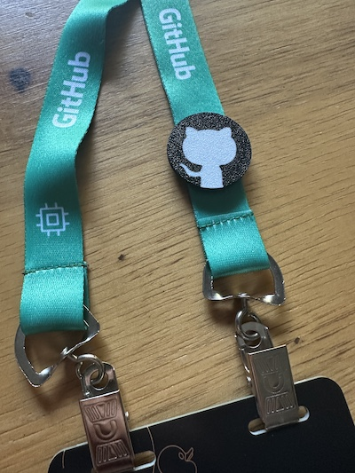

# Lanyard Tags
Fun decorations to add to your lanyard during a conference or event. They are super easy to 3D print and support tapping with your phone! 🤓

| Front | Back |
| :-: | :-: |
|  |  |

Check out the other [designs](docs/designs.md). 🚀

## How to Use
If you received your tag prebuilt, it came preloaded with a link to these instructions. Using an NFC tool app, you can overwrite the default content to make it your own.

Examples:
- Your digital business card (name, email, phone, etc.)
- A website link
    - LinkedIn profile
    - GitHub profile
    - Instagram profile
    - Personal website
- WiFi credentials

### Download the app
If your phone supports tapping to pay at a store, it will likely support reading and writing NFC tags. Below are 2 recommendations:

- NFC Tools: [iOS](https://apps.apple.com/us/app/nfc-tools/id1252962749), [Android](https://play.google.com/store/apps/details?id=com.wakdev.wdnfc)
- BLK Cards: [iOS](https://apps.apple.com/us/app/blk-cards/id6443552250), [Android](https://play.google.com/store/apps/details?id=hk.emertech.blk)

###  Update the tag
Use an app to change the tag content to a website, social profile, or virtual business card.

1. Open the **NFC Tools** app
1. Tap the `Write` button.
1. Tap the `Add a record` button.
1. Select the type of record and fill in the details.
1. Verify the number of bytes is less than 504 (the tag's capacity).
1. Tap the `Write` button and it will say "Ready to Scan".
1. Hold your phone near the tag, similar to tapping to pay at a store.
1. The app will show success and the tag is ready to be used.

### Read a tag
If you made it this far, you likely know how to read a tag. 😉 If not, here are the steps:

1. Bring your phone near the tag, similar to tapping to pay at a store.
    1. Your phone will show a notification with the tag's content.
1. Tap the notification to open the link, contact card, or other content.

## Build your own 🤓
That's cool and all, but how do I make one?!  
Check out the [build your own](docs/build-your-own.md) page for a step-by-step guide. 🧑‍🚀
